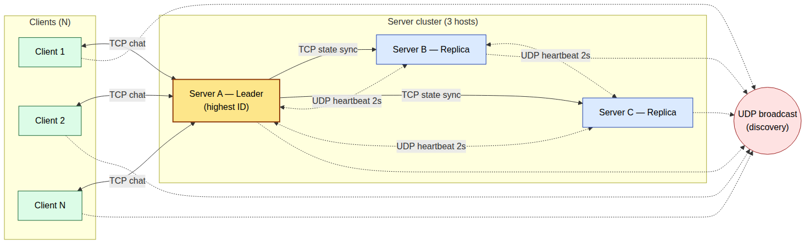

# chatapp-ds


A distributed chat application in **Java 21**. Multiple clients join a shared
chat room and exchange messages through a group of replicated servers
coordinated by a single elected leader. The system scales in the number of
clients and tolerates the crash of any single server, including the leader.

Group 16 project for the Distributed Systems course, University of Stuttgart,
Sommersemester 2026.

> **Status:** under active development. The repository skeleton and CI are in
> place; discovery, heartbeats, election and the chat path are being built
> across milestones M1 to M3. See the [issue board](https://github.com/robertfeo/chatapp-ds/issues).

## Overview

- **Client-Server with replicated servers.** Three server processes, each with
  a unique numeric ID. Clients always talk to the current leader.
- **Single leader.** The leader fans chat messages out to every connected
  client and replicates chat history to the other servers.
- **Crash tolerant.** Servers exchange UDP heartbeats; a missing heartbeat
  triggers an automatic leader election and failover, with no manual step.
- **Zero configuration on the wire.** Servers and clients find each other with
  UDP broadcast discovery, so there is no central registry to start first.
- **No middleware.** Coordination is built on the Java standard library only.
  Jackson (JSON) and SLF4J/Logback (logging) are the only utility libraries.

## Architecture



Three servers (one leader, two replicas) and N clients. Solid links are TCP,
dotted links are UDP.

- **Clients to leader (TCP):** clients send chat messages to the leader, which
  fans them back out to all connected clients over the same connections.
- **Leader to replicas (TCP):** the leader pushes chat-history deltas so every
  replica can take over with the same state.
- **Server to server (UDP unicast):** heartbeats every 2 seconds for failure
  detection.
- **Everyone to the broadcast address (UDP broadcast):** dynamic discovery.

Source of the diagram: `docs/diagrams/architecture.mmd`.

## How it works

### Dynamic discovery (UDP broadcast)

A starting server broadcasts a `DISCOVERY_HELLO` with its `(id, host, port)`.
Peers that hear it add it to their local **group view** and reply by unicast
with their own `(id, host, port)` and the current leader id. A client does the
same to learn which server is the leader before opening its TCP connection.
Announcements repeat periodically (about every 10 s) so late joiners are picked
up. There is no central registry; each participant builds its own group view.

### Leader election (Bully algorithm)

Election is the **Bully algorithm** (Garcia-Molina), the highest-ID-wins scheme,
not LCR. When a server notices the leader's heartbeat has stopped, it broadcasts
an `ELECTION` inquiry. Any live server with a higher id replies with `ANSWER`
("I am alive") and runs its own election; if no higher id answers within ~2 s,
the server wins and broadcasts `I_AM_LEADER` (the coordinator message). An
`I_AM_LEADER` from a lower id is bullied out with a new election. The highest
live id always wins, so the outcome is deterministic for a given set of servers.

Server ids are unique numbers generated randomly at startup (from a large space,
so collisions are negligible), so they never have to be assigned by hand.

### Heartbeats and failure detection

Every server sends a `HEARTBEAT` to each peer every **2 seconds** and tracks the
last time it heard from each peer. A peer silent for more than **6 seconds** is
declared dead and dropped from the group view. If the dead peer was the leader,
every surviving replica starts an election at once.

### Fault tolerance and failover

Chat keeps working as long as one server is alive. On a leader crash, a new
leader is elected within a few seconds. Clients notice the loss through a TCP
disconnect or the `I_AM_LEADER` announcement, re-run discovery, and reconnect to
the new leader; messages typed during the gap are buffered and sent on
reconnect. Because the leader replicates history deltas to replicas on every
accepted message, the new leader serves the same history as the old one, and a
rejoining replica requests a full snapshot to catch up.

## Tech stack

| Concern | Choice |
|---|---|
| Language | Java 21 LTS (virtual threads, records, sealed classes) |
| Build | Maven, shaded fat-jar |
| Networking | `java.net.DatagramSocket` (UDP), `java.net.Socket` / `ServerSocket` (TCP) |
| Concurrency | `java.util.concurrent`, virtual threads for per-client handlers |
| Serialization | Jackson (JSON wire envelopes) |
| Logging | SLF4J API + Logback, structured `key=value` events |
| Tests | JUnit 5 (Surefire unit, Failsafe integration) |
| Format | Spotless, Google Java Format |

## Repository layout

```
src/main/java/com/chatapp/
  server/      server core, per-client handlers, chat fan-out
  client/      CLI client: discovery, connect, send/receive, reconnect
  protocol/    sealed Message types and the JSON codec
  discovery/   UDP broadcast announce/listen, group view
  election/    highest-ID-wins election
  heartbeat/   2s heartbeats, 6s peer-dead timeout
  config/      env-var loading and shared constants
docs/          architecture diagram, team plan, project form
.github/workflows/ci.yml   staged CI pipeline
AGENTS.md      contributor and coding-agent guide
```

## Build

Requires JDK 21 and Maven.

```bash
mvn -B verify          # format check + unit + integration tests
mvn package            # build the shaded fat-jar at target/chatapp.jar
```

Or via the `Makefile`:

```bash
make package           # build target/chatapp.jar
make test              # unit tests
make lint              # Spotless format check
make format            # auto-apply Google Java Format
```

## Run

Every host runs the **same** fat-jar; behaviour is selected by a subcommand and
configured purely through environment variables (no hardcoded hosts).

```bash
# Start a server (its id is generated randomly at startup)
LISTEN_PORT=5003 DISCOVERY_PORT=5000 BROADCAST_ADDR=255.255.255.255 \
  java -jar target/chatapp.jar server

# Start a client
DISCOVERY_PORT=5000 BROADCAST_ADDR=255.255.255.255 \
  java -jar target/chatapp.jar client
```

The demo runs on three physical hosts on a private LAN: a Raspberry Pi 4 plus two
laptops, as servers and clients. Each server picks a random id at startup, so the
leader is whichever server drew the highest id. No Docker, no VMs. Avoid eduroam,
which blocks UDP broadcast; use a phone hotspot or a home Wi-Fi router. A ready
runbook lives in [`docs/demo_runbook.md`](docs/demo_runbook.md).

### Configuration

| Variable | Meaning | Default |
|---|---|---|
| `SERVER_ID` | Unique numeric server id. Generated randomly when unset; set it only when you want deterministic ids (several servers on one machine). | auto (random) |
| `LISTEN_HOST` | Address the server binds | `0.0.0.0` |
| `LISTEN_PORT` | TCP port for chat and state sync | none |
| `DISCOVERY_PORT` | UDP port for discovery and heartbeats | none |
| `BROADCAST_ADDR` | Subnet broadcast address for discovery | none |

### Timing constants

| Constant | Value |
|---|---|
| `HEARTBEAT_INTERVAL_S` | 2 |
| `PEER_DEAD_TIMEOUT_S` | 6 |
| `ELECTION_TIMEOUT_S` | 2 |
| `DISCOVERY_REANNOUNCE_S` | 10 |

## Testing and CI

GitHub Actions runs a staged pipeline on every push and pull request:

1. **Format check** (Spotless) fails fast on style violations.
2. **Build** compiles and packages the fat-jar.
3. **Unit tests** (Surefire, `*Test`): fast, deterministic logic such as the
   election function and the protocol codec.
4. **Integration tests** (Failsafe, `*IT`): spawn real server and client JVMs to
   exercise discovery convergence, chat, and failover.

`mvn -B verify` reproduces the whole chain locally.

## Contributing

Read [`AGENTS.md`](AGENTS.md) first: it captures the workflow (one issue, one
branch, one PR), the testing policy, and the frozen architecture. The full task
breakdown and who owns what is in [`docs/team_plan.md`](docs/team_plan.md). All
artifacts in this repository are in English.
