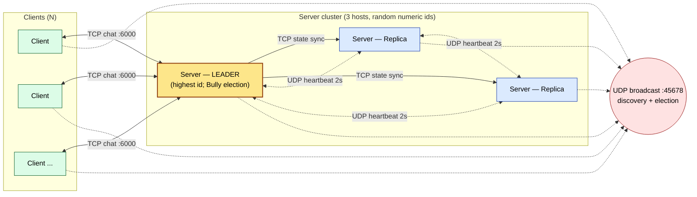

# Updated Project Form — Group 16, SS 26

> Draft for team review. Once Robert and Samet sign off, Samet copies the text into the official PDF form, exports non-editable, and submits on RELAX.

## Project Information

- **Group ID:** 16
- **Semester:** SS 26
- **Students:**
  1. Ayham Alhasan
  2. Samet Yilmaz
  3. Robert-Bogdan Fesko
- **Project Title:** Chat Application

## Project Description

A distributed chat application implemented in **Java 21**. Multiple clients join a shared chat room and exchange messages through a group of replicated servers. The system is scalable in the number of clients and tolerates the crash of any single server, including the leader.

Compared to the original Preliminary Form, this version follows the professor's feedback: leader election is simplified to a highest-ID-wins scheme, vector clocks are dropped, and complex reliable ordered multicast is replaced by per-message TCP fan-out from the leader. The system uses UDP broadcast for dynamic discovery and UDP heartbeats for failure detection. It runs on three physical hosts on a local network, with no external middleware. The implementation language was changed from Python to Java to match the team's stronger fluency in Java.

## Architectural Model

Client-Server architecture model with replicated servers and leader-based coordination.

- Clients communicate with the current leader server over TCP.
- The leader receives chat messages and fans them out to every connected client over the same TCP connections.
- The leader replicates state (chat history deltas) to the other replica servers over TCP.
- Servers exchange UDP heartbeats to detect crashes and trigger failover.
- One server acts as leader at any time; replicas stand by and take over on crash.

## Dynamic Discovery of Hosts

Dynamic discovery uses **UDP broadcast** on the local subnet. There is no central registry; every participant builds its own local group view from received broadcasts.

- A new server, on startup, broadcasts a `DISCOVERY_HELLO` carrying its `(id, host, port)`.
- Existing servers listen continuously for `DISCOVERY_HELLO`. On receipt, they add the new server to their local group view and reply (unicast) with `DISCOVERY_REPLY` carrying their own `(id, host, port)` and the current leader id.
- A new client follows the same pattern: it broadcasts a discovery request and learns the current leader id, then opens a TCP connection to that leader.
- Periodic re-announcement (~10 s) ensures late joiners are eventually included.

## Voting (Leader Election)

Leader election uses the **Bully algorithm** (Garcia-Molina, 1982), the crash-fault-tolerant Highest-ID-Wins scheme from the lecture. Not LCR and not a ring: the servers form a small group that already knows each other's ids through discovery.

- Each server has a unique numeric id, generated randomly at startup from a large space so it never has to be assigned by hand and the collision probability between the few servers is negligible (the same approach as random node ids in DHTs).
- Each server tracks heartbeats from its peers. If the leader's heartbeat is missing for more than the timeout (6 s), the server starts an election.
- Three message types (Bully): `ELECTION` (a candidate calls an election), `ANSWER` (a higher-id server replies "I am alive" to suppress a lower candidate and take over), and `I_AM_LEADER` (the winning coordinator announces itself).
- Election round for a server P:
  1. P sends an `ELECTION` inquiry. Any live server with a higher id replies with `ANSWER` and starts its own election.
  2. If no higher-id server answers within 2 s, P wins and broadcasts `I_AM_LEADER` to all servers and clients.
  3. If a higher-id server answered, P stands down and waits for that server's `I_AM_LEADER`; if none arrives in time, P restarts the election.
  4. If P ever receives an `I_AM_LEADER` from a lower id, it "bullies" it out by starting a new election.
- The highest live id always wins, so the outcome is deterministic for a given set of alive servers, and a crashed leader is automatically replaced by the next-highest survivor.

## Fault Tolerance

The system handles crash failures of clients and servers.

- Servers exchange `HEARTBEAT` messages every **2 seconds**.
- A peer with no heartbeat for **6 seconds** is declared dead and removed from the local group view.
- If the dead peer is the leader, election starts immediately on every surviving replica.
- Automatic failover guarantees that chat continues to function as long as at least one server is alive.
- Clients detect a leader loss via TCP disconnect or an `I_AM_LEADER` announcement and reconnect to the new leader after re-running discovery. Messages typed by the user during the gap are buffered locally and sent after reconnect.
- Replica state sync ensures the new leader serves the same chat history as the old one: the leader sends history deltas to replicas on each accepted message, and a rejoining replica requests a full history snapshot.

## Implementation Stack

| Concern | Choice |
|---|---|
| Language | Java 21 LTS |
| Build | Maven (`pom.xml`) |
| Networking | `java.net.DatagramSocket` (UDP), `java.net.Socket` / `ServerSocket` (TCP) |
| Concurrency | `java.util.concurrent`, virtual threads (per-client server handlers) |
| Serialization | Jackson (JSON wire envelopes) |
| Logging | SLF4J API + Logback |
| Terminal UI | JLine (live per-server dashboard) |
| Tests | JUnit 5 |

No middleware (no ZooKeeper, no Akka, no Spring). The above libraries are pure utility — they handle JSON, logging, and the terminal dashboard, and do not provide coordination, leader election, or replication primitives.

## Constants

| Name | Value |
|---|---|
| HEARTBEAT_INTERVAL_S | 2 |
| PEER_DEAD_TIMEOUT_S | 6 |
| ELECTION_TIMEOUT_S | 2 |
| DISCOVERY_REANNOUNCE_S | 10 |

## System Architecture Diagram

Components: 3 server processes (one acting as leader, two as replicas) and N clients. Arrows: clients↔leader chat over TCP, leader→replicas state sync over TCP, servers↔servers heartbeats over UDP unicast, all participants↔broadcast address for discovery over UDP broadcast.

**Legend** — solid arrows = TCP, dotted arrows = UDP. Bidirectional `<-->` for chat (request + fan-out on the same socket) and heartbeats (peer-to-peer). One-way `-->` for state sync (leader pushes deltas to replicas). Source: `docs/diagrams/architecture.mmd`; rendered PNG `docs/diagrams/architecture.png` is the artifact dropped into the official Project Report PDF (issues #23/#22).

## Deployment

The demo runs on three physical hosts on a private LAN: Robert's Raspberry Pi 4 (8 GB RAM, aarch64) plus two student laptops, each running a server and one or more clients. All hosts run the same shaded fat-jar built from `mvn package` and start with **no configuration**: `java -jar chatapp.jar server` detects the host's own LAN address, picks a random numeric id, and uses the default ports (UDP 45678 for discovery/heartbeats, TCP 6000 for chat). The host that draws the highest id becomes the leader; environment variables exist only as optional overrides (used by the local dev runner and the tests). The UDP discovery port is deliberately not 4500, which on Windows is the IPsec NAT-T port and would swallow inbound discovery datagrams.
